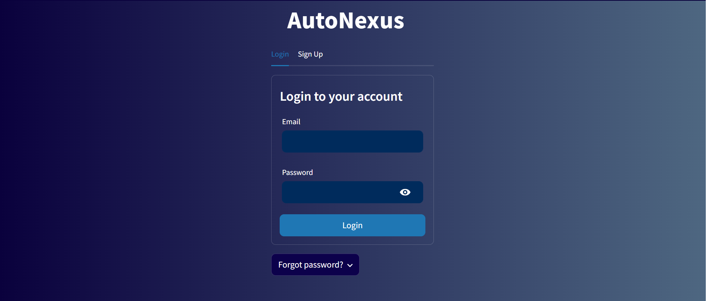
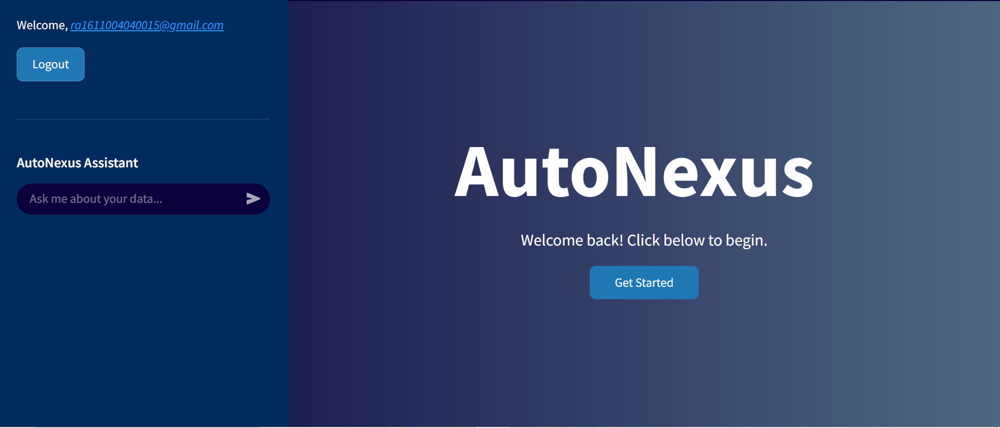
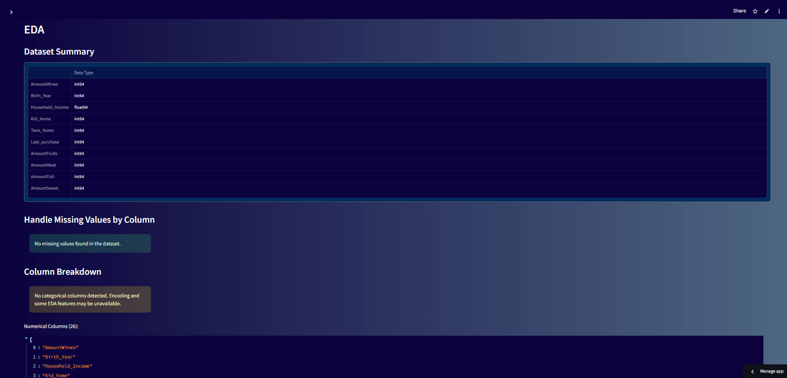
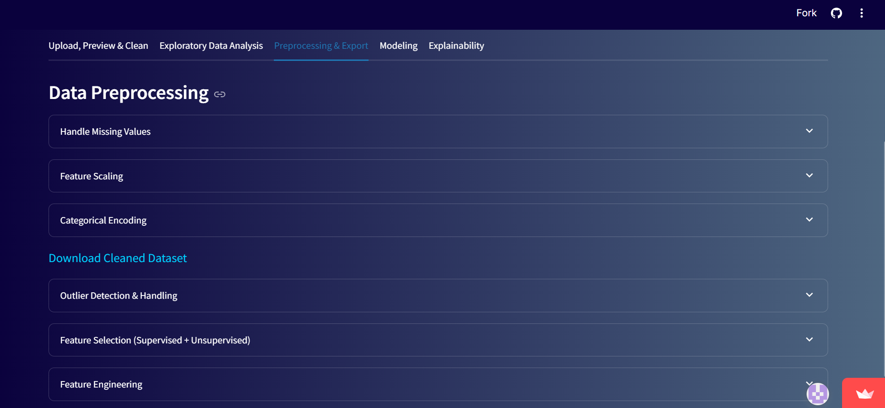
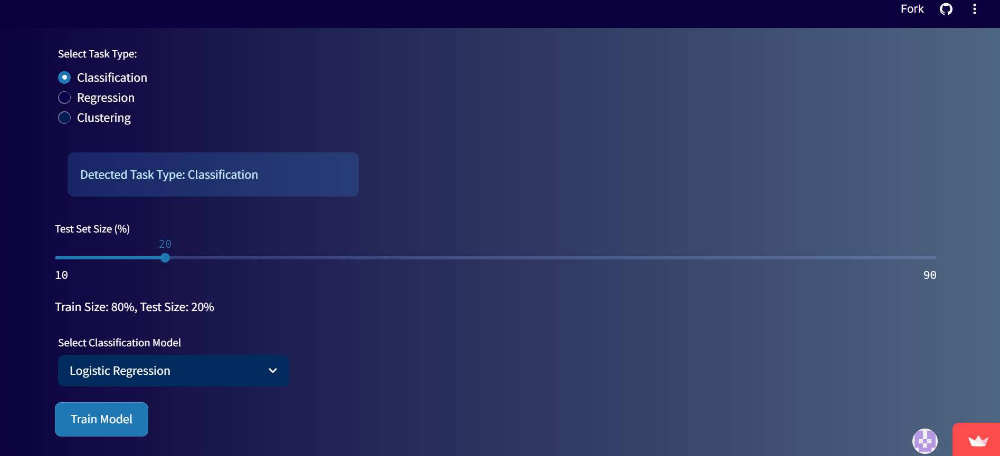
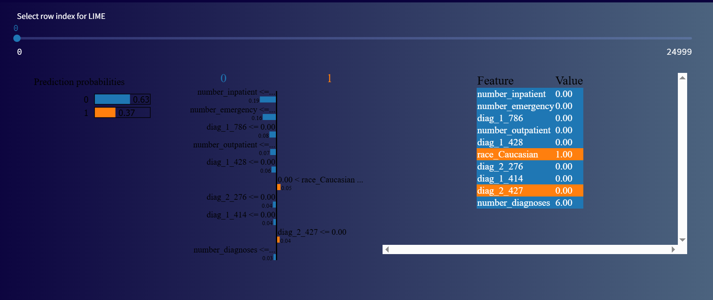

# 🚀 AutoNexus — Professional AutoML & Explainability Platform

**AutoNexus** is a secure, multi-user, no-code AutoML web application built with **Streamlit** and powered by a **Firebase** backend. It enables users to create an account, upload datasets, perform a full end-to-end machine learning workflow, and save their results. The platform guides users from data cleaning and exploratory data analysis to advanced model tuning and interpretation using **SHAP** and **LIME**.

-----

## ✨ Features

AutoNexus provides a comprehensive suite of tools for any data scientist, from beginner to expert.

#### **User & Session Management**

  - 🔐 **Secure User Authentication:** Full login, signup, and password reset functionality powered by Firebase.
  - ☁️ **Cloud Storage:** (Coming Soon) Each user's datasets are stored in their own secure cloud folder.

#### **Interactive AI Assistant**
  - **Conversational Guidance:** Get help and explanations at any step of the workflow.
  - **Context-Aware:** The assistant, powered by Google's Gemini models, understands the user's current dataset and progress in the app.
  - **Data Interpretation:** Ask questions in plain English about your data, models, and results.

#### **Data Preparation Workflow**

  - 📁 **CSV Dataset Upload:** Upload datasets for analysis.
  - 🧹 **Data Cleaning:** A suite of tools to handle duplicates, rename columns, standardize text, and more.
  - 📊 **Exploratory Data Analysis (EDA):** Generate interactive plots (histograms, scatter plots, heatmaps) and statistical summaries to understand the data.
  - 🔬 **Advanced Preprocessing:**
      - Handle missing values with various strategies (mean, median, mode).
      - **Model-Based Feature Selection** using Random Forest to identify the most predictive features.
      - Statistical feature selection (ANOVA, Mutual Information).
  - ⚖️ **Class Imbalance Handling:** Correctly apply SMOTE, Random OverSampling, or Random UnderSampling to the training data to improve model performance on skewed datasets.

#### **Modeling & Evaluation**

  - 🤖 **Model Training:** Train a variety of classification and regression models, including:
      - Logistic/Linear Regression, Ridge, Lasso
      - Random Forest, Decision Trees
      - XGBoost
  - ⚙️ **Advanced Hyperparameter Tuning:**
      - Go beyond default settings with automated tuning.
      * Choose between **GridSearchCV** (exhaustive) and **RandomizedSearchCV** (fast and efficient) to find the best parameters for your model.
  - 📈 **Robust Evaluation:**
      * Utilizes a proper **Train/Validate/Test split** for reliable performance metrics.
      * View detailed classification reports, confusion matrices, and key regression metrics (R², MAE, RMSE).

#### **Explainable AI (XAI)**

  - 🧠 **Model Interpretability:** Understand *why* your model makes its predictions.
      - **SHAP:** Global and local feature importance plots.
      - **LIME:** Explain individual predictions on a case-by-case basis.
  - 💾 **Download Artifacts:** Download the final, trained model (`.pkl`) for offline use or deployment.

-----

## 🔗 Live Demo

[Click here to try AutoNexus on Streamlit Cloud](https://autonexus.streamlit.app/)

-----

## 📸 Screenshots

### 🔹 Secure Login Page

### 🔹 AI Assistant

### 🔹 EDA Summary

### 🔹 Pre-Processing

### 🔹 Model Training

### 🔹 LIME Explanation

## 🛠️ Technology Stack

  - **Frontend:** Streamlit
  - **Backend Services:** Firebase (Authentication, Cloud Storage), FastAPI (Planned)
  - **Data Science:** Pandas, Scikit-learn, Imbalanced-learn
  - **Modeling:** XGBoost, InterpretML
  - **Explainability:** SHAP, LIME

-----

## 🙋‍♀️ Author

**Srilekha Tirumala Vinjamoori**  
MS in Information Systems | Business Analytics | UTA 
 
📫 [LinkedIn](https://www.linkedin.com/in/srilekha-tirumala-vinjamoori/)  
🌐 [Portfolio](https://srilekhatv-portfolio.vercel.app)

-----

## 📄 License

MIT License